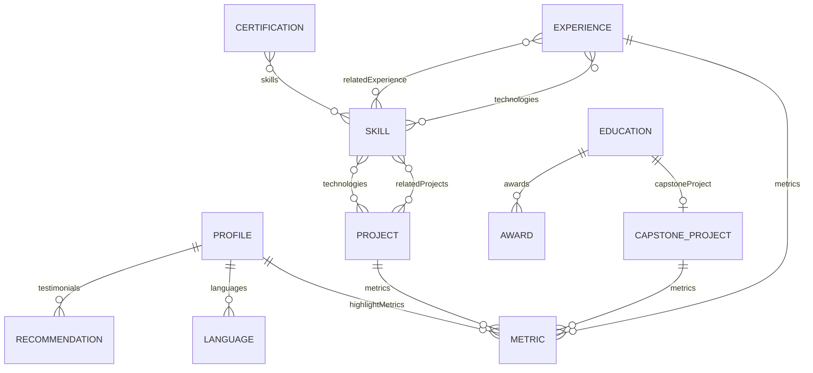

# Data Model: Formagio.dev

**Feature**: `001-formagio-dev-portfolio` | **Date**: 2026-08-24

## Entity Definitions

All content entities use a bilingual text structure:

```typescript
type BilingualText = { pt: string; en: string }
type BilingualArray = { pt: string[]; en: string[] }
```

---

### Profile

The root identity entity — personal brand information displayed across hero,
about, and footer sections.

| Field | Type | Required | Description |
|-------|------|----------|-------------|
| `name` | `string` | ✅ | Full professional name |
| `headline` | `BilingualText` | ✅ | Professional headline / tagline |
| `bio` | `BilingualText` | ✅ | Extended professional summary (About section) |
| `shortBio` | `BilingualText` | ✅ | One-line bio for hero section |
| `photo` | `string` | ✅ | Path to professional photo/avatar |
| `email` | `string` | ✅ | Professional contact email |
| `linkedin` | `string` | ✅ | LinkedIn profile URL |
| `github` | `string` | ❌ | GitHub profile URL |
| `website` | `string` | ❌ | Portfolio domain URL |
| `location` | `BilingualText` | ✅ | Current location |
| `availability` | `BilingualText` | ✅ | Availability statement (e.g., "Open to opportunities") |
| `languages` | `Language[]` | ✅ | Spoken languages with proficiency |
| `highlightMetrics` | `Metric[]` | ✅ | Key stats for hero section (years exp, initiatives, etc.) |

**Relationships**: Referenced by Hero, About, Contact, and Footer components.

---

### Language

| Field | Type | Required | Description |
|-------|------|----------|-------------|
| `name` | `BilingualText` | ✅ | Language name |
| `level` | `BilingualText` | ✅ | Proficiency level |
| `code` | `string` | ✅ | ISO code (e.g., "pt-BR", "en-US", "es") |

---

### Metric

Reusable metric entity used across Profile, Experience, and Project entities.

| Field | Type | Required | Description |
|-------|------|----------|-------------|
| `value` | `string` | ✅ | Numeric or formatted value (e.g., "140+", "50%", "R$ 90k+") |
| `label` | `BilingualText` | ✅ | Metric description |
| `icon` | `string` | ❌ | Optional SVG icon identifier |

---

### Experience

Career timeline entries displayed in the Experience section.

| Field | Type | Required | Description |
|-------|------|----------|-------------|
| `id` | `string` | ✅ | Unique identifier (slug) |
| `company` | `string` | ✅ | Company name |
| `companyLogo` | `string` | ❌ | Path to company logo |
| `title` | `BilingualText` | ✅ | Job title |
| `employmentType` | `BilingualText` | ✅ | Full-time, Intern, Freelance, etc. |
| `dateRange` | `DateRange` | ✅ | Start and end dates |
| `location` | `BilingualText` | ✅ | Work location |
| `locationType` | `BilingualText` | ✅ | Remote, Hybrid, On-site |
| `description` | `BilingualText` | ✅ | Role description |
| `achievements` | `BilingualArray` | ✅ | Bullet-point achievements with metrics |
| `technologies` | `string[]` | ✅ | Technologies used in this role |
| `metrics` | `Metric[]` | ❌ | Key quantified results |

**Relationships**: References Technology entities via `technologies` array.
Referenced by Skills for project cross-referencing.

**State transitions**: N/A (static content).

**Validation rules**:
- `dateRange.start` MUST be a valid ISO date string.
- `dateRange.end` MUST be a valid ISO date string or `null` (current position).
- `id` MUST be unique across all Experience entries.
- `achievements` MUST contain at least 1 item in each language.

---

### DateRange

| Field | Type | Required | Description |
|-------|------|----------|-------------|
| `start` | `string` | ✅ | ISO date string (YYYY-MM format) |
| `end` | `string\|null` | ✅ | ISO date string or null for "present" |

---

### Project

Portfolio project entries displayed in the Projects section.

| Field | Type | Required | Description |
|-------|------|----------|-------------|
| `id` | `string` | ✅ | Unique identifier (slug) |
| `title` | `BilingualText` | ✅ | Project name |
| `description` | `BilingualText` | ✅ | Full project description |
| `shortDescription` | `BilingualText` | ✅ | Card-level summary (2-3 sentences) |
| `category` | `string` | ✅ | Category slug: `bi-products`, `automation`, `ai-solutions`, `data-engineering`, `entrepreneurial` |
| `dateRange` | `DateRange` | ✅ | Project timeline |
| `association` | `string` | ✅ | Associated company or institution |
| `metrics` | `Metric[]` | ✅ | Quantified impact results |
| `technologies` | `string[]` | ✅ | Technologies used |
| `highlights` | `BilingualArray` | ❌ | Key achievements / bullet points |
| `image` | `string` | ❌ | Project thumbnail/screenshot |
| `featured` | `boolean` | ❌ | Whether to highlight on homepage (default: false) |

**Relationships**: References Technology entities via `technologies`. Grouped by
`category` for filtering. Associated with Experience via `association`.

**Validation rules**:
- `id` MUST be unique across all Project entries.
- `metrics` MUST contain at least 1 item.
- `category` MUST be one of the defined category slugs.
- `technologies` MUST contain at least 1 item.

**Categories** (with bilingual labels):
| Slug | PT-BR | EN-US |
|------|-------|-------|
| `bi-products` | Produtos de BI | BI Products |
| `automation` | Automação | Automation |
| `ai-solutions` | Soluções de IA | AI Solutions |
| `data-engineering` | Engenharia de Dados | Data Engineering |
| `entrepreneurial` | Empreendedorismo | Entrepreneurial |

---

### Skill

Technical and soft skills displayed in the Skills section.

| Field | Type | Required | Description |
|-------|------|----------|-------------|
| `id` | `string` | ✅ | Unique identifier |
| `name` | `string` | ✅ | Skill name (same in both languages for tech) |
| `category` | `string` | ✅ | Category slug |
| `isPrimary` | `boolean` | ✅ | Whether this is a primary/core skill |
| `icon` | `string` | ❌ | SVG icon path or identifier |
| `relatedProjects` | `string[]` | ❌ | Array of Project `id`s that use this skill |
| `relatedExperience` | `string[]` | ❌ | Array of Experience `id`s using this skill |

**Skill Categories**:
| Slug | PT-BR | EN-US |
|------|-------|-------|
| `bi-analytics` | BI & Analytics | BI & Analytics |
| `data-engineering` | Engenharia de Dados | Data Engineering |
| `automation` | Automação | Automation |
| `ai-ml` | IA & Machine Learning | AI & Machine Learning |
| `programming` | Programação | Programming |
| `erp-sap` | ERP / SAP | ERP / SAP |
| `soft-skills` | Competências Pessoais | Soft Skills |

**Validation rules**:
- `id` MUST be unique across all Skill entries.
- `category` MUST be one of the defined category slugs.

---

### Certification

Professional certifications displayed in the Certifications section.

| Field | Type | Required | Description |
|-------|------|----------|-------------|
| `id` | `string` | ✅ | Unique identifier |
| `title` | `string` | ✅ | Certification title (original language) |
| `issuer` | `string` | ✅ | Issuing organization name |
| `issuerLogo` | `string` | ❌ | Path to issuer logo |
| `issueDate` | `string` | ✅ | ISO date (YYYY-MM format) |
| `expirationDate` | `string\|null` | ❌ | ISO date or null if no expiration |
| `credentialId` | `string` | ❌ | Credential ID code |
| `credentialUrl` | `string` | ❌ | Verification URL |
| `skills` | `string[]` | ❌ | Associated skill names |
| `domain` | `string` | ✅ | Domain category slug |

**Certification Domains**:
| Slug | PT-BR | EN-US |
|------|-------|-------|
| `bi-analytics` | BI & Analytics | BI & Analytics |
| `ai-ml` | IA & Machine Learning | AI & Machine Learning |
| `data-engineering` | Engenharia de Dados | Data Engineering |
| `sap` | SAP | SAP |
| `programming` | Programação | Programming |
| `leadership` | Liderança & Gestão | Leadership & Management |
| `english` | Inglês | English Proficiency |
| `other` | Outros | Other |

**Validation rules**:
- `id` MUST be unique across all Certification entries.
- `issueDate` MUST be a valid YYYY-MM string.
- `domain` MUST be one of the defined domain slugs.

---

### Education

Academic background displayed in the Education section.

| Field | Type | Required | Description |
|-------|------|----------|-------------|
| `id` | `string` | ✅ | Unique identifier |
| `institution` | `string` | ✅ | University/school name |
| `institutionLogo` | `string` | ❌ | Path to institution logo |
| `degree` | `BilingualText` | ✅ | Degree type |
| `field` | `BilingualText` | ✅ | Field of study |
| `dateRange` | `DateRange` | ✅ | Enrollment period |
| `description` | `BilingualText` | ✅ | Course description |
| `activities` | `BilingualArray` | ❌ | Extracurricular activities |
| `capstoneProject` | `CapstoneProject\|null` | ❌ | Final project details |
| `awards` | `Award[]` | ❌ | Academic awards |

---

### CapstoneProject

| Field | Type | Required | Description |
|-------|------|----------|-------------|
| `title` | `BilingualText` | ✅ | Project title |
| `description` | `BilingualText` | ✅ | Project summary |
| `metrics` | `Metric[]` | ✅ | Quantified results |
| `award` | `BilingualText` | ❌ | Recognition received |

---

### Award

| Field | Type | Required | Description |
|-------|------|----------|-------------|
| `title` | `BilingualText` | ✅ | Award name |
| `issuer` | `string` | ✅ | Awarding institution |
| `date` | `string` | ✅ | ISO date (YYYY-MM) |
| `description` | `BilingualText` | ✅ | Award description |

---

### Recommendation

Professional testimonials displayed in the About section.

| Field | Type | Required | Description |
|-------|------|----------|-------------|
| `id` | `string` | ✅ | Unique identifier |
| `authorName` | `string` | ✅ | Recommender's full name |
| `authorTitle` | `BilingualText` | ✅ | Recommender's professional title |
| `relationship` | `BilingualText` | ✅ | Relationship to Lucas |
| `text` | `BilingualText` | ✅ | Recommendation text |
| `date` | `string` | ✅ | Date of recommendation (YYYY-MM-DD) |

**Validation rules**:
- `id` MUST be unique across all Recommendation entries.
- `text` MUST have content in both `pt` and `en` keys.

---

## Entity Relationship Diagram


