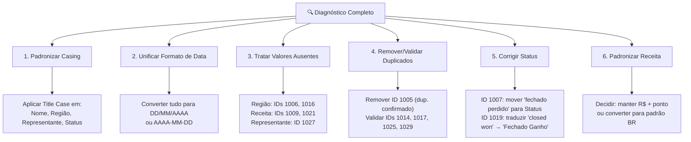

# Diagnóstico de Qualidade — f_Vendas.csv

> **Arquivo:** [f_Vendas.csv](file:///d:/Lucas Formagio/Projects/Jornada de Dados - Projetos/Trilha Claude - Projeto 2 - Engenharia e Analise de Dados/Bloco 01 - Limpeza, diagnostico, prompt e validacao/f_Vendas.csv)
> **Registros:** 30 linhas de dados (+ 1 cabeçalho) · **Colunas:** 9

---

## Resumo Executivo

| Categoria de Problema | Qtd. Registros Afetados | Severidade |
|---|---|---|
| Casing inconsistente (nomes, região, representante, status) | ~28 de 30 | 🟡 Média |
| Formatos de data mistos | 30 (3 formatos diferentes) | 🔴 Alta |
| Valores ausentes (região, receita, status, representante) | 5 | 🔴 Alta |
| Duplicados confirmados e suspeitos | 5 pares | 🔴 Alta |
| Formato monetário (ponto vs vírgula) | 28 | 🟡 Média |
| Status em idioma estrangeiro | 1 | 🟡 Média |
| Status deslocado para coluna Observações | 1 | 🔴 Alta |

---

## 1. Valores Ausentes / Vazios

Campos obrigatórios estão em branco em **5 registros**:

| Linha | ID Pedido | Coluna Vazia | Observação no CSV |
|---|---|---|---|
| 7 | 1006 | **Região** | — |
| 8 | 1007 | **Status** | `fechado perdido` (deslocado para Observações) |
| 10 | 1009 | **Receita** | `receita ausente` |
| 17 | 1016 | **Região** | — |
| 22 | 1021 | **Receita** | `receita ausente` |
| 28 | 1027 | **Representante** | `sem representante` |

> [!IMPORTANT]
> **ID 1007 (Linha 8):** O valor `fechado perdido` aparece na coluna Observações, mas a coluna Status está vazia. Isso indica um erro de preenchimento — o status foi digitado na coluna errada.

---

## 2. Formatos de Data Inconsistentes

São usados **3 formatos distintos** na coluna `Data do Pedido`:

| Formato | Exemplos | Qtd. |
|---|---|---|
| `DD/MM/AAAA` | `15/01/2024`, `03/02/2024` | **16** |
| `AAAA-MM-DD` (ISO) | `2024-01-22`, `2024-02-20` | **7** |
| `D mês AAAA` (extenso) | `5 jan. 2024`, `3 março 2024`, `2 maio 2024` | **7** |

**Detalhamento por formato:**

DD/MM/AAAA (16 registros)

- Linha 2 (ID 1001): `15/01/2024`
- Linha 5 (ID 1004): `03/02/2024`
- Linha 6 (ID 1005): `15/01/2024`
- Linha 7 (ID 1006): `14/02/2024`
- Linha 10 (ID 1009): `10/03/2024`
- Linha 12 (ID 1011): `22/03/2024`
- Linha 14 (ID 1013): `08/04/2024`
- Linha 16 (ID 1015): `19/04/2024`
- Linha 17 (ID 1016): `25/04/2024`
- Linha 19 (ID 1018): `09/05/2024`
- Linha 21 (ID 1020): `23/05/2024`
- Linha 22 (ID 1021): `02/06/2024`
- Linha 24 (ID 1023): `18/06/2024`
- Linha 26 (ID 1025): `28/06/2024`
- Linha 28 (ID 1027): `11/07/2024`
- Linha 29 (ID 1028): `19/07/2024`

AAAA-MM-DD — ISO (7 registros)

- Linha 3 (ID 1002): `2024-01-22`
- Linha 8 (ID 1007): `2024-02-20`
- Linha 11 (ID 1010): `2024-03-15`
- Linha 15 (ID 1014): `2024-04-12`
- Linha 20 (ID 1019): `2024-05-17`
- Linha 25 (ID 1024): `2024-06-25`
- Linha 30 (ID 1029): `2024-07-26`

D mês AAAA — extenso (7 registros)

- Linha 4 (ID 1003): `5 jan. 2024`
- Linha 9 (ID 1008): `3 março 2024`
- Linha 13 (ID 1012): `1 abr. 2024`
- Linha 18 (ID 1017): `2 maio 2024`
- Linha 23 (ID 1022): `10 jun. 2024`
- Linha 27 (ID 1026): `4 jul. 2024`
- Linha 31 (ID 1030): `2 ago. 2024`

> [!WARNING]
> A mistura de formatos impossibilita parsing automático confiável sem tratamento prévio. Recomenda-se padronizar para `DD/MM/AAAA` (padrão brasileiro) ou `AAAA-MM-DD` (ISO 8601).

---

## 3. Casing Inconsistente

A inconsistência de capitalização afeta **4 colunas**:

### 3.1 Nome do Cliente

| Padrão | Qtd. | Exemplos |
|---|---|---|
| Title Case ✅ | 16 | `João Silva`, `Emília Dias`, `Priscila Pinto` |
| minúsculas ❌ | 7 | `maria souza`, `linda nunes`, `kevin barros`, `jaime torres`, `tomé neves`, `linda nunes`, `carlos ribeiro` |
| MAIÚSCULAS ❌ | 7 | `PEDRO OLIVEIRA`, `JAIME TORRES`, `DÉRICO MENDES`, `EMÍLIA DIAS`, `CARINA VALENTE`, `PRISCILA PINTO`, `FÁBIO DUARTE` |

### 3.2 Região

| Padrão | Qtd. | Exemplos |
|---|---|---|
| Title Case ✅ | 21 | `Sudeste`, `Centro-Oeste`, `Norte` |
| minúsculas ❌ | 2 | `sudeste` (L3), `sul` (L20) |
| MAIÚSCULAS ❌ | 4 | `SUL` (L4, L31), `NORDESTE` (L13), `NORTE` (L23) |
| Misto ❌ | 1 | `Centro-oeste` (L30) — falta maiúscula no "O" |

### 3.3 Representante

| Padrão | Qtd. | Exemplos |
|---|---|---|
| Title Case ✅ | 20 | `Sara Jorge`, `Tomás Bastos`, `Bruno Carvalho` |
| minúsculas ❌ | 3 | `sara jorge`, `bruno carvalho` |
| MAIÚSCULAS ❌ | 6 | `BRUNO CARVALHO`, `RAQUEL VERDE`, `TOMÁS BASTOS`, `SARA JORGE` |

### 3.4 Status

| Padrão | Qtd. | Exemplos |
|---|---|---|
| Title Case ✅ | 25 | `Fechado Ganho`, `Fechado Perdido` |
| minúsculas ❌ | 4 | `fechado ganho` (L3, L12, L27), `closed won` (L20) |

---

## 4. Status em Idioma Estrangeiro

| Linha | ID Pedido | Valor Encontrado | Valor Esperado |
|---|---|---|---|
| 20 | 1019 | `closed won` | `Fechado Ganho` |

> [!NOTE]
> Apenas 1 registro apresenta status em inglês. Os demais estão em português.

---

## 5. Registros Duplicados

### 5.1 Duplicado Confirmado (exato)

| Par | Cliente | Data | Receita | Produto |
|---|---|---|---|---|
| ID 1001 (L2) ↔ ID 1005 (L6) | João Silva | 15/01/2024 | R$ 4.320,00 | Licença de Software |

> [!CAUTION]
> O ID 1005 está marcado na coluna Observações como `duplicado`. É uma cópia exata do ID 1001 — mesmo cliente, data, valor e produto.

### 5.2 Duplicados Suspeitos (mesmo nome + receita + produto, datas diferentes)

| Par | Cliente | Receita | Produto | Datas |
|---|---|---|---|---|
| ID 1004 (L5) ↔ ID 1017 (L18) | Emília Dias | R$ 2.200,00 | Licença de Software | 03/02 vs 02/05 |
| ID 1006 (L7) ↔ ID 1029 (L30) | Carlos Ribeiro | R$ 3.750,00 | Consultoria | 14/02 vs 26/07 |
| ID 1007 (L8) ↔ ID 1025 (L26) | Linda Nunes | R$ 990,00 | Hardware | 20/02 vs 28/06 |
| ID 1008 (L9) ↔ ID 1014 (L15) | Jaime Torres | R$ 12.400,00 | Pac. Empresarial | 03/03 vs 12/04 |

> [!NOTE]
> Os IDs 1014 e 1029 estão marcados como `possível duplicado` nas Observações. As datas são diferentes, então podem ser vendas legítimas recorrentes — requer validação de negócio.

---

## 6. Formato Monetário

**Todos os 28 registros com receita** usam ponto como separador decimal (`R$ 4320.00`).

O padrão brasileiro esperado seria com vírgula (`R$ 4.320,00`). No entanto, como **100% dos registros seguem o mesmo padrão**, este é um problema de padronização uniforme e pode ser tratado de forma global.

> [!TIP]
> Se os dados serão processados por ferramentas que esperam separador de milhar com ponto e decimal com vírgula (padrão ABNT), será necessário reformatar. Se serão processados por código (Python/Pandas), o formato com ponto decimal é na verdade mais conveniente — basta remover o `R$ `.

---

## 7. Dados na Coluna Observações que Sinalizam Problemas

| Linha | ID | Observação | Ação Sugerida |
|---|---|---|---|
| 4 | 1003 | `cliente recorrente` | Informativo — sem ação |
| 6 | 1005 | `duplicado` | ⚠️ Remover registro (confirmado na Seção 5.1) |
| 8 | 1007 | `fechado perdido` | ⚠️ Mover para coluna Status (Status está vazio) |
| 10 | 1009 | `receita ausente` | ⚠️ Preencher receita ou investigar |
| 15 | 1014 | `possível duplicado` | 🔍 Validar com negócio (ver Seção 5.2) |
| 22 | 1021 | `receita ausente` | ⚠️ Preencher receita ou investigar |
| 28 | 1027 | `sem representante` | ⚠️ Atribuir representante |
| 30 | 1029 | `possível duplicado` | 🔍 Validar com negócio (ver Seção 5.2) |

---

## Resumo de Ações de Limpeza Recomendadas

| # | Ação | Prioridade | Impacto |
|---|---|---|---|
| 1 | Padronizar datas para formato único | 🔴 Alta | Parsing, ordenação, filtros |
| 2 | Preencher valores ausentes (Receita, Região, Status, Representante) | 🔴 Alta | Integridade dos dados |
| 3 | Remover duplicado confirmado (ID 1005) | 🔴 Alta | Métricas infladas |
| 4 | Corrigir status (ID 1007: mover da coluna Obs; ID 1019: traduzir) | 🔴 Alta | Classificação correta |
| 5 | Padronizar casing (Title Case) em nomes, regiões, representantes | 🟡 Média | Agrupamentos, relatórios |
| 6 | Validar duplicados suspeitos com área de negócio | 🟡 Média | Precisão das métricas |
| 7 | Definir formato monetário padrão | 🟢 Baixa | Já é uniforme |
